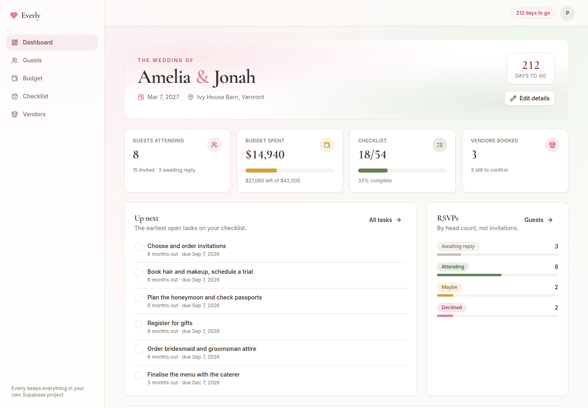

# Everly — Wedding Planner

A complete wedding planning app: guest list and RSVPs, budget tracking, a
pre-populated planning checklist, a vendor directory, and a dashboard that ties
them together. Built with Next.js 14 (App Router), TypeScript in strict mode,
TailwindCSS, shadcn/ui and Supabase.



---

## Features

**Dashboard**
- Countdown to the wedding day, with names, date and venue
- Overview cards: guests attending, budget spent (with progress), checklist
  completion, vendors booked
- "Up next" — the earliest open checklist tasks, tickable in place
- RSVP breakdown by head count and your five heaviest spending categories

**Guests**
- Add, edit and delete guests; RSVP status is editable inline from the table
- Party size (covers plus-ones and children), side, wedding-party role, table
  assignment, dietary needs and free-form notes
- Search across name, email, role and table; filter by RSVP status
- Head-count stats that respect party size, not just row count

**Budget**
- Ten budget categories seeded from your total budget, all editable
- Log expenses against a category and optionally a vendor, with due dates and a
  paid/unpaid flag
- Per-category progress bars that turn amber near the allocation and rose once
  over it
- Totals for allocated, spent, remaining and still-owed

**Checklist / Timeline**
- 54 tasks pre-populated across eight phases: 12+ months out through to after
  the wedding
- Due dates derived automatically from your wedding date
- Filter by all / to do / done, add your own tasks, per-phase completion counts
- Optimistic ticking, so the checkbox never lags behind the click

**Vendors**
- Directory of vendors by type (venue, catering, photography, florist, …)
- Contact details, website, quoted cost, deposit paid and outstanding balance
- Status tracking: researching → contacted → booked / declined
- Search and filter by type

**Throughout**
- Email + password auth via Supabase, with route protection in middleware
- Loading skeletons, error states with retry, and toasts on every mutation
- Mobile-first responsive layout: tables become cards, sidebar becomes a sheet

---

## Tech stack

| Layer | Choice |
| --- | --- |
| Framework | Next.js 14 (App Router) |
| Language | TypeScript, `strict` + `noUncheckedIndexedAccess` |
| UI | React 18, TailwindCSS, shadcn/ui (Radix primitives) |
| Data fetching | TanStack Query (React Query) v5 |
| Backend | Supabase — Postgres, Row Level Security, Auth |
| Icons / toasts | lucide-react, sonner |
| Dates | date-fns |

---

## Setup

### 1. Install

```bash
npm install
```

### 2. Create a Supabase project

Sign in at [supabase.com](https://supabase.com) and create a project. Then open
**SQL Editor**, paste the contents of
[`supabase/migrations/0001_init.sql`](supabase/migrations/0001_init.sql) and run
it. That creates all six tables, their indexes and the Row Level Security
policies.

If you use the Supabase CLI instead:

```bash
supabase link --project-ref <your-project-ref>
supabase db push
```

### 3. Environment variables

```bash
cp .env.example .env.local
```

Fill in the two values from **Project Settings → API**:

```bash
NEXT_PUBLIC_SUPABASE_URL=https://your-project-ref.supabase.co
NEXT_PUBLIC_SUPABASE_ANON_KEY=your-anon-key
```

The anon key is meant to be public — every table is protected by RLS, so a user
can only ever read or write rows where `user_id = auth.uid()`.

### 4. Auth settings (optional but recommended for local use)

By default Supabase requires email confirmation. For a local prototype, turn it
off under **Authentication → Providers → Email → Confirm email** so you can sign
up and land straight in the app. If you leave it on, the app shows a "check your
inbox" screen after signup — that is expected.

### 5. Run

```bash
npm run dev
```

Open <http://localhost:3000>, create an account, and the first-run setup asks for
partner names, date, venue and total budget. Submitting it seeds your budget
categories and the full 54-task checklist.

---

## Scripts

```bash
npm run dev        # development server
npm run build      # production build
npm run start      # serve the production build
npm run lint       # eslint (next/core-web-vitals)
npm run typecheck  # tsc --noEmit
npm test           # Playwright end-to-end suite
```

---

## Tests

The end-to-end suite covers every feature: auth and route protection, first-run
seeding, guests, budget, checklist, vendors, the dashboard roll-ups, and the
mobile layout.

```bash
npx playwright install chromium   # once
npm test
```

It needs **no Supabase project and no credentials**. `tests/mock-supabase.mjs`
is a small in-memory stand-in for the GoTrue and PostgREST endpoints the app
calls, and Playwright starts it alongside a production build of the real app.
Everything else is genuine — the real middleware, the real `@supabase/ssr`
cookie flow, the real React Query layer — so the suite catches integration bugs
a component test would miss. It scopes every request to the bearer token's user,
the same way row-level security does in Postgres.

Handy flags:

```bash
npm test -- tests/e2e/guests.spec.ts   # one spec
npm run test:headed                    # watch it drive the browser
npm run test:report                    # open the HTML report
```

If your environment ships its own Chromium, point at it with
`PLAYWRIGHT_CHROMIUM_PATH=/path/to/chrome` instead of installing one.

---

## Database schema

Six tables, all keyed to `auth.users(id)`:

| Table | Holds |
| --- | --- |
| `wedding_settings` | One row per account: partner names, date, venue, total budget |
| `guests` | Guest list, RSVP status, party size, side, role, table, dietary notes |
| `budget_categories` | Named allocations that spending is tracked against |
| `expenses` | Individual costs, linked to a category and optionally a vendor |
| `vendors` | Directory entries with contacts, quoted cost, deposit and status |
| `timeline_tasks` | Checklist items with phase, due date and completion state |

Deleting a category or vendor uses `on delete set null`, so the expense history
survives and simply becomes uncategorised. Deleting an account cascades
everywhere.

The TypeScript mirror of this schema lives in
[`src/lib/types.ts`](src/lib/types.ts). If you change the SQL, regenerate it:

```bash
npx supabase gen types typescript --project-id <ref> > src/lib/types.ts
```

---

## Project structure

```
src/
├── app/
│   ├── (auth)/               # split-screen sign in / sign up
│   ├── (app)/                # authenticated shell + the five pages
│   ├── globals.css           # Tailwind layers and the colour tokens
│   └── layout.tsx            # fonts and metadata
├── components/
│   ├── ui/                   # shadcn/ui primitives
│   ├── layout/               # app shell, nav, page header
│   ├── shared/               # stat card, empty state, query state, row menu
│   ├── dashboard|guests|budget|timeline|vendors/
│   └── workspace/            # first-run setup and wedding-details dialog
├── lib/
│   ├── supabase/             # browser, server and middleware clients
│   ├── hooks/                # one React Query module per domain
│   ├── constants.ts          # RSVP/vendor/phase config, default seeds
│   ├── timeline.ts           # phase → due-date maths
│   └── types.ts              # Database type
└── middleware.ts             # session refresh + route protection

tests/
├── mock-supabase.mjs         # in-memory GoTrue + PostgREST for the suite
└── e2e/                      # one spec per feature area
```

`src/middleware.ts` has to live inside `src/`, next to `app/` — a root-level
`middleware.ts` is silently ignored when the app lives in `src/app`, and route
protection then falls through to the layout check.

---

## Design notes

The palette is a warm ivory ground with dusty rose as the primary, sage for
positive states and champagne for warnings — set as HSL CSS custom properties in
`globals.css` and extended in `tailwind.config.ts`. Headings use Cormorant
Garamond, body copy uses Inter. It is a single light theme by design; there is no
dark mode toggle.

## The iOS & Android app

`mobile/` holds an Expo (React Native) version of the same planner, pointed at
the same Supabase project — one database, two front ends. The schema, RLS
policies and all the pure logic are shared; the screens are native.

See [`mobile/README.md`](mobile/README.md) for setup, running it in Xcode, and
the App Review checklist. Note that it typechecks but has never been compiled
on a Mac — no iOS toolchain was available where it was written.

---

## Deploying

Push to a Git repo and import it into Vercel, adding the same two environment
variables. No other configuration is needed — the app is entirely client and
edge/server rendering against Supabase.
